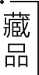
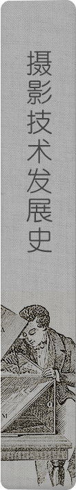
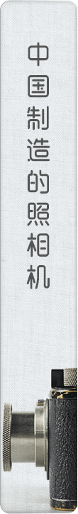
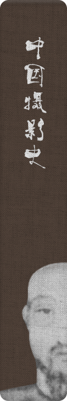

# 切片

---

切片一般用于软件产品的快速成型。试想一下，客户要求马上看到界面效果，手上只有部分psd设计稿，从零开始编写程序一 是时间来不及，二 是开发需求不明确。

于是切片出场，用来满足客户和开发的需求。根据不同要求会进行混合式切片，一般一个网站7-11个页面，大概需要4-12个小时不等。混合式切片是部分编写部分html，或者编写部分自动脚本，再配合传统切片手段。

需要工具:Ps+文本编辑器+git代码器

安装完git后，打开终端拷贝代码到本地。

或者直接在浏览器内打开

**拷贝到本地**

```sh
git clone https://github.com/qdqdGit/qdqdGit.github.io.git
```


**在线编辑**


### 页面类型

#### 首页


结构较为简单, 修改部分仅为链接 `55`-`81`行, 空白和换行无意义,仅是方便代码阅读。

`a`标签为链接, 链接指向为`href`包裹的部分, `a`标签包裹了链接点击部分, 如`a` 包裹`img`、包裹`文字` ,分别为_图片链接_和_文字链接_ 。 `img` 的 `src`为图片内容指向, 有_相对_和_绝对_两种形式,

- 绝对形式 `http://www.baidu.com/image/xxxx.jpg`

- 相对形式 `images/前言.png`

绝对形式就是常见的图片链接,相对形式是图片相对于项目文件的位置。

> home.html `55` -`81`行
> 
> ```html
> <section class="main">
>     <a href="test.5.html">
>       
>   </a>
>   <section>
>      <a style="margin-right: 11px;" href="test.5.html">
>              
>      </a>
>      <a style="margin-right: 6px;" href="test.4.html">
>              
>      </a>
>      <a style="margin-right: 8px;" href="test.6-index.html">
>              
>      </a>
>      <a style="margin-right: 7px;" href="test.5-index.html">
>              
>      </a>
>      <a href="test.7-inex.html">
>         
>      </a>
>      <a href="test.7-index.html">
>            
>      </a>
>   </section>
> </section>
> ```

#### 书签页


> test.4.html `36` -`54`行

```html
        <section>
            <a href="test.4-1.html">
                
            </a>
            <a href="test.3-1.html">
                
            </a>
            <a href="test.2.html">
                
            </a>
            <a href="test.html">
                
            </a>
            <a class="img_clic" href="4-4.html">
                
                <div id="nra"></div>
            </a>

        </section>
```

#### 综合页

- 图文混合型
- 切片型


综合页较为复杂,存在多种形式, 个别需要根据设计图进行切片。

##### 图文混合型

凡是一段前言+几个图片链接都是这个类型


只需安装这个结构替换内容即可

> test.3-1.html `32`到`69`

```html
    <section class="main">
        <span>|丽水摄影博物馆|Photography Museum of Lishui China</span>
        <header>摄影术前史</header>
        <section>
            <header>
                摄影术是人类想把视觉所见的客观世界纪录保存下来，在光学化学、物理学等科学研究发展进步条件下的产物。在整个摄影技术发展过程中，人们以前赴后继的科学探索精神和源源不断的创造力，形成了一部丰富多样、充满智慧的摄影技术发展史。
            </header>
        </section>

        <section>
            <header class="b">小孔成像</header>
            <div>
                <a href="3/public/5-1-12.html">
                
                    ▲进入专题
                </a>
            </div>
        </section>

        <section>
            <header class="b">暗箱</header>
            <div>
                <a href="3/public/5-1-14.html">
                
                ▲进入专题</a>
            </div>
        </section>

        <section>
            <header class="b">早期的实验与发现</header>
            <div>
                <a href="3/public/5-1-13.html">
                ▲进入专题</a>
            </div>
        </section>

    </section>
```

##### 切图型

主体内容全是图片, 其实_图文混合型_ 和_切图型_没有区别, 这个分开的原因是为了方便。一些页面用_图文_更为方便, 一些用切图型。比如说下面的例子


注意这个部分的措位, 在网页中实现比较麻烦直接用_切图法_解决


查看文件内容

> 4-4.html 截图


主题内容完全看不懂, 主体内容的切片过程如下.

**切片过程**

用PS打开在效果图, 按`ctrl`+`R`使用标尺工具，拖动标尺线进行切片

  

导出为HTML格式   

   

复制到项目文件夹


复制模板页的`头`和`尾`到`效果图.html`


打开`效果图.html`, 在没有使用http服务器的情况下样式会有所改变(上传后不影响结果), 案例中使用了http服务器  
按`F12`使用调试工具，找到需要添加链接的图片

 案例中添加了baidu作为实验链接


#### 内容页

- 纯文本型
- 纯图片型
- 切片型

纯文本型已经很少在项目中见到, 内容页为某件藏品的具体内容, 内容页的切片过程和上述切片完全一致,这小节重点关注*纯图片型*

 

这类页面比重最多，但较为简单，所以准备了一个程序进行半自动操作[hello.exe](https://pan.baidu.com/s/1vF3cU-OtM4vKP_DrHtUrxQ)

注意: 效果图只能识别`.jpg`和 `.png`格式, 图片文件名会是生成文件的文件名


将程序放到`D`目录下，在同级目录下新建`publics`文件夹，复制效果图文件夹位置


按`ctrl`+`r` 再输入 `cmd`打开命令行

用`D：`进入到`D`盘，使用`hello.exe`生成页面

复制`publics`文件夹到`qdqdGit.github.io\3`目录


复制效果图到`qdqdGit.github.io\3\images`

  

[点击访问](https://qdqdgit.github.io/home.html)  
默认是clsmp的移动版
# aui-master  
[新页面](https://qdqdgit.github.io/aui-master/test)
